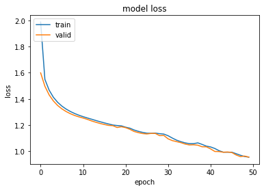

# Automatic-Speech-Recognition sử dụng model transformer
Model input: shape = (batch_size, seq_len, d_model)  
Model output shape = (batch_size, max_out_len)
# Dữ liệu
Đây là một đoạn văn kể về câu chuyện Lão Hạc của nhà văn Nam Cao
# Cấu trúc thư mục
Dữ liệu được để trong thư mục dataset, trong thư mục dataset có các thư mục con và tên thư mục con sẽ được dùng để làm label, trong thư mục con đó sẽ chứa một file audio.wav là âm thanh của label đó
<audio controls src='description/dataset/A Lão già tệ lắm Tôi ăn ở với lão như thế mà lão xử với tôi như thế này Thì ra tôi già bằng này tuổi đầu rồi còn đánh lừa một con chó/audio.wav' ></audio>
# Đồ thị thể hiện lỗi
Do train ngắt quãng nhiều lần nên sẽ có nhiều đồ thị lỗi (đồ thị cuối cùng ở trong file .ipynb)

# Những điểm cần lưu ý
- Với input mà model có thể nhận là (batch_size, seq_len, d_model), chúng ta sẽ sử dụng CONDV để trích xuất đặc trưng của đoạn âm thanh, ngoài ra do đoạn âm thanh khá dài nên ta dùng strikes là 2 để giảm chiều của đoạn âm thanh đó
- Với output thì là tiếng Việt, sẽ có những ký tự như ă, ắ, ơ, ớ, è, ê nên khi tạo vectorize ta phải thêm vào
